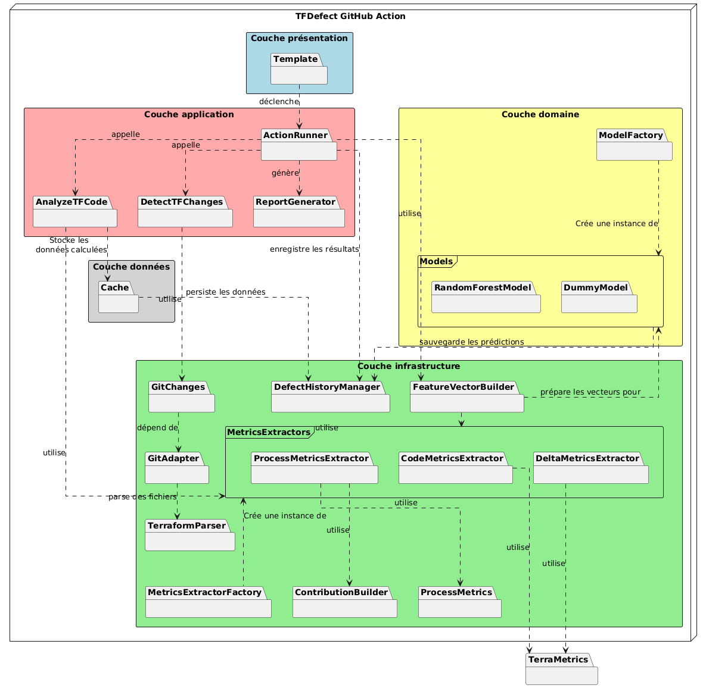
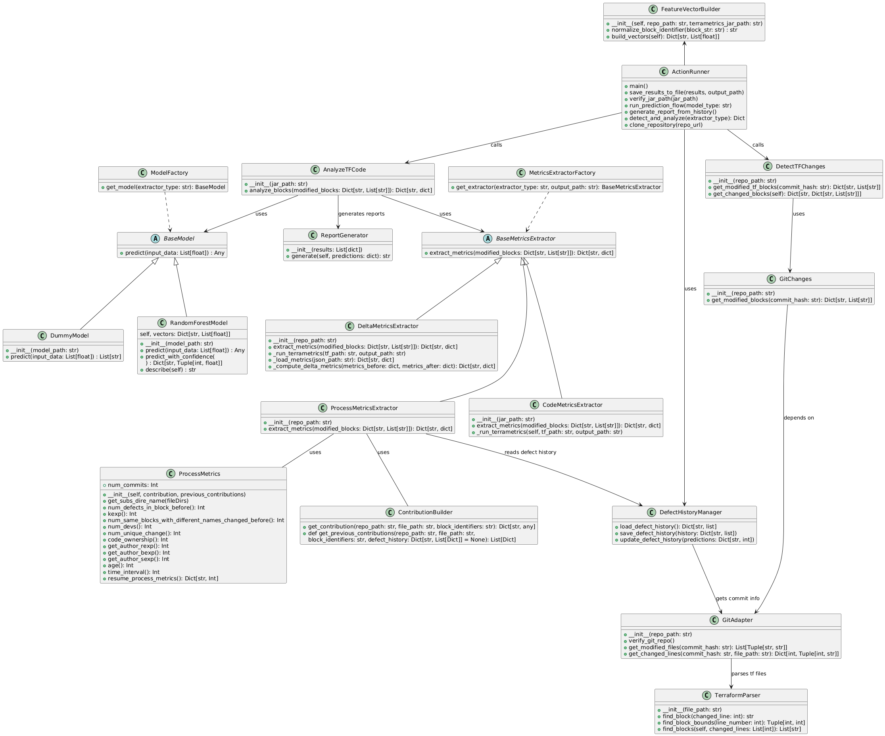

# Documentation d'architecture de l'Action GitHub TFDefect

## Table des matières
- [Documentation d'architecture de l'Action GitHub TFDefect](#documentation-darchitecture-de-laction-github-tfdefect)
  - [Table des matières](#table-des-matières)
  - [Introduction](#introduction)
  - [Vues architecturales et diagrammes](#vues-architecturales-et-diagrammes)
    - [Vue architecturale de type module](#vue-architecturale-de-type-module)
      - [Description de l'architecture](#description-de-larchitecture)
      - [Couches](#couches)
    - [Diagramme de classes](#diagramme-de-classes)
      - [Description des classes](#description-des-classes)
    - [Diagramme de séquence](#diagramme-de-séquence)
      - [Flux Principal d'Exécution](#flux-principal-dexécution)
      - [1. Initialisation du processus](#1-initialisation-du-processus)
      - [2. Préparation du code](#2-préparation-du-code)
      - [3. Traitement conditionnel](#3-traitement-conditionnel)
      - [4. Extraction des blocs modifiés](#4-extraction-des-blocs-modifiés)
      - [5. Génération des vecteurs de caractéristiques](#5-génération-des-vecteurs-de-caractéristiques)
      - [6. Prédiction des défauts](#6-prédiction-des-défauts)
      - [7. Gestion des résultats](#7-gestion-des-résultats)
      - [8. Communication des résultats](#8-communication-des-résultats)
  - [Technologies utilisées](#technologies-utilisées)
    - [Librairies utilisées:](#librairies-utilisées)
      - [Gestion des Dépôts Git](#gestion-des-dépôts-git)
      - [Outils d'analyse et traitement](#outils-danalyse-et-traitement)
      - [Gestion des Logs et Exécution de Commandes](#gestion-des-logs-et-exécution-de-commandes)
      - [Manipulation des Fichiers et Formats de Données](#manipulation-des-fichiers-et-formats-de-données)
      - [Machine Learning et Analyse des Données](#machine-learning-et-analyse-des-données)
      - [Tests et Assurance Qualité](#tests-et-assurance-qualité)
      - [Annotations et Sécurité](#annotations-et-sécurité)
    - [Outils DevOps et CI/CD](#outils-devops-et-cicd)
    - [Gestion des dépendances et environnements](#gestion-des-dépendances-et-environnements)
  - [Conclusion](#conclusion)
  

## Introduction

Ce document décrit l'architecture technique du projet en détaillant les différentes couches, composants et technologies utilisées. Son objectif est de fournir une vue d’ensemble claire et structurée de l’architecture de l'Action GitHub, tout en mettant en avant les interactions entre les différentes parties de l’application.

Pour cela, nous présenterons une vue architecturale de type module afin d'illustrer les dépendances fonctionnelles entre les composants du système, ainsi qu'un diagramme de classes détaillant la structure interne et les relations entre les différentes entités logicielles. De plus, un diagramme de séquence permettra de montrer le flux d'exécution de TfDefectGA. Nous aborderons également les technologies utilisées telles, que les outils DevOps et les bibliothèques Python.

## Vues architecturales et diagrammes

### Vue architecturale de type module

La vue architecturale suivante est de type "Utilise". Elle permet de représenter les dépendances fonctionnelles entre les différents composants du système de détection de bogues. Cela permet de comprendre quels modules utilisent quels autres modules pour exécuter leurs fonctionnalités.

#### Description de l'architecture

Le système est conçu selon les principes de la *Clean Architecture*, permettant une séparation claire des responsabilités et une grande maintenabilité.

#### Couches
L'architecture de l'Action GitHub TFDefect se compose des 4 couches suivantes:

- **Couche présentation** : Il s'agit de l'interface utilisateur qui permet d’afficher les résultats et d’interagir avec l’action GitHub.
- **Couche application** : Elle contient les cas d’utilisation spécifiques de l’application. Le module `ActionRunner` permet l’exécution du processus d'analyse. Le module `AnalyzeTFCode` analyse les blocs Terraform modifiés pour en tirer des métriques. Le module `DetectTFChanges` identifie les blocs Terraform modifiés. Quant au module `ReportGenerator`, il génère des rapports à partir des résultats.
- **Couche données**: Elle contient une cache qui stocke les données calculées temporairement pour optimiser les performances et éviter des calculs inutiles.
- **Couche domaine** : C’est le cœur de l’application, où sont définies les règles métiers et les modèles de données.
  - `Models`: Regroupe les modèles d’apprentissage automatique utilisés pour l’analyse des métriques. On y retrouve le module `RandomForestModel` pour prédire des anomalies ou tendances dans les métriques Terraform. On y retrouve également le module `DummyModel`, qui est un modèle naïf utilisé pour faire des tests.
- **Couche infrastructure** : Elle gère les interactions avec des services externes (Git, fichiers Terraform, etc.). Elle contient les adaptateurs `GitChanges`, `GitAdapter` et `TerraformParser`. Elle contient également le bloc `MetricsExtractors` qui regroupe les 3 méthodes de calcul des métriques suivantes: `CodeMetricsAdapter`, `ProcessMetricsAdapter` et `DeltaMetricsAdapter`. Aussi, elle contient `ProcessMetrics` qui permet de faire les calculs pour l'extracteur `ProcessMetricsAdapter`. On retrouve dans cette couche le module `FeatureVectorBuilder` qui construit le vecteur de métriques envoyé au modèle de Machine Learning ainsi que le module `DefectHistoryManager` qui gère l'historique des prévisions. De plus, elle contient `MetricsExtractorFactory`, qui permet d'utiliser l'extracteur de métriques choisi par un utilisateur, et `ModelFactory` qui permet de choisir le modèle de Machine Learning utilisé dans l'analyse.
- **Autre (externe)**:
  - `TerraMetrics`: Outil qui permet de calculer des métriques pour un fichier Terraform 

### Diagramme de classes

Le diagramme de classes suivant illustre la structure du système en mettant en évidence les différentes classes, leurs responsabilités et leurs relations.  

#### Description des classes

- **ActionRunner** : Gère l'exécution du processus global, y compris la gestion des résultats, la vérification des fichiers JAR et le clonage du dépôt Git.  
- **DetectTFChanges** : Identifie les blocs Terraform modifiés dans un commit donné. Utilise GitChanges pour détecter les fichiers .tf modifiés, puis TerraformParser pour extraire les blocs individuels. 
- **AnalyzeTFCode** : Analyse les blocs Terraform extraits pour en tirer des métriques ou des informations utiles. Coordonne l'utilisation des différents extracteurs de métriques via MetricsExtractorFactory.
- **BaseModel** : Classe abstraite pour un modèle de prédiction, définissant l'interface commune que tous les modèles doivent implémenter
- **RandomForestModel** : Étend `BaseModel` et fournit une implémentation concrète d'un modèle prédictif basé sur l'algorithme Random Forest
- **DummyModel** : Étend `BaseModel` en utilisant un modèle fictif utilisé pour les tests. Retourne des prédictions aléatoires ou prédéfinies sans réel apprentissage, servant principalement à des fins de démonstration.
- **FeatureVectorBuilder**: Cette classe est responsable de construire des vecteurs de caractéristiques (features) pour les blocs Terraform modifiés. Elle combine trois types de métriques: code, delta et process.
- **ReportGenerator** : Génère des rapports textuels ou JSON à partir des résultats de l'analyse.  
- **GitChanges** : Récupère les fichiers modifiés dans un commit donné à l’aide de `GitAdapter`.  
- **GitAdapter** : Interface permettant d'interagir avec un dépôt Git (vérification, extraction des fichiers modifiés et des lignes de code changées).  
- **TerraformParser** : Analyse les fichiers Terraform pour identifier et extraire des blocs spécifiques.  
- **BaseMetricsExtractor**: Classe abstraite de base pour les extracteurs de métriques, définissant l'interface commune à tous les extracteurs.
- **CodeMetricsAdapter** : Calcule des métriques statiques à partir des blocs Terraform à l'aide de TerraMetrics.  
- **ProcessMetricsAdapter**: Extrait les métriques liées au processus de développement (historique, auteurs)
- **ProcessMetrics**: Fournit des méthodes pour calculer des métriques avancées sur l'historique des modifications, comme la distribution des auteurs, l'âge du code et la stabilité des blocs Terraform.
- **DeltaMetricsAdapter**: Compare les métriques avant/après un commit
- **MetricsExtractorFactory**: Classe implémentant le pattern Factory qui retourne une instance de l'extracteur de métriques choisi par le développeur, facilitant l'extension du système avec de nouveaux types d'extracteurs.
- **ModelFactory**: Classe implémentant également le pattern Factory, permettant de sélectionner et instancier dynamiquement le modèle de Machine Learning approprié selon les besoins de l'analyse.
- **DefectHistoryManager**: classe responsable de la gestion de l'historique des défauts prédits dans le temps.
 

### Diagramme de séquence

Le diagramme de séquence suivant illustre le processus complet de détection automatique de bugs dans le code Terraform à l'aide de l'outil TFDefectGA. Il représente l'interaction entre différents composants du système et le flux d'exécution lors de l'analyse de code pour la détection de défauts potentiels.

#### Flux Principal d'Exécution

#### 1. Initialisation du processus

- L'utilisateur démarre l'application en exécutant `action_runner.py` avec l'argument `--model randomforest`, spécifiant l'algorithme d'apprentissage à utiliser.
- Le système commence par vérifier que l'environnement est correctement configuré :
  - Présence d’un dépôt Git valide
  - Présence du fichier JAR requis

#### 2. Préparation du code

- L’`ActionRunner` exécute `terraform fmt` pour standardiser le format des fichiers Terraform, facilitant ainsi l’analyse.
- Le système identifie les fichiers Terraform (`.tf`) qui ont été modifiés dans le dépôt Git.

#### 3. Traitement conditionnel

- Aucun fichier modifié :
  - Le système en informe simplement l’utilisateur et termine le processus.
- Fichiers modifiés détectés :
  - Le système poursuit avec l’analyse détaillée.

#### 4. Extraction des blocs modifiés

- Le composant `DetectTFChanges` extrait les blocs spécifiques de code Terraform qui ont été modifiés, plutôt que d’analyser les fichiers entiers.
- Ces blocs représentent les unités de code qui seront évaluées pour la détection de bugs.

#### 5. Génération des vecteurs de caractéristiques

- Le `FeatureVectorBuilder` coordonne l’extraction des métriques de code des blocs modifiés.
- Il utilise le `CodeMetricsExtractor`, obtenu via `MetricsExtractorFactory`, pour calculer diverses métriques du code (complexité, taille, etc.).
- `AnalyzeTFCode` traite les blocs et retourne les métriques extraites.
- Ces métriques sont transformées en vecteurs de caractéristiques utilisables par le modèle de machine learning.

#### 6. Prédiction des défauts

- Le `ModelFactory` instancie le modèle `RandomForest` demandé.
- Le modèle analyse les vecteurs de caractéristiques et prédit la probabilité de défauts pour chaque bloc de code.
- Le résultat est un mapping entre les identifiants de blocs et leurs prédictions de défauts.

#### 7. Gestion des résultats

- Les prédictions sont enregistrées dans l’historique des défauts via le `DefectHistoryManager` pour un suivi à long terme.
- Le `ReportGenerator` crée un rapport détaillé des résultats, incluant :
  - Les prédictions
  - Les informations sur le modèle utilisé
- Le système charge l’historique complet des défauts pour contextualiser les nouveaux résultats.

#### 8. Communication des résultats

- L’`ActionRunner` présente finalement les résultats à l’utilisateur dans le terminal, avec les informations pertinentes sur les défauts potentiels détectés.

## Technologies utilisées

Le projet est développé en Python. Ce langage est utilisé pour exécuter l’Action GitHub, analyser les fichiers Terraform, interagir avec Git et appliquer des modèles de Machine Learning pour détecter les bogues.

### Librairies utilisées:

#### Gestion des Dépôts Git
- **GitPython** : Permet d’interagir avec les dépôts Git, récupérer les fichiers modifiés et extraire l’historique des commits.  

#### Outils d'analyse et traitement
- **PyDriller**: bibliothèque Python extraire des informations sur un dépôt GitHub telles que les commits, les développeurs qui contribuent et les modifications.

#### Gestion des Logs et Exécution de Commandes 
- **Logging** : Utilisé pour enregistrer et suivre les événements et erreurs du programme.  
- **Subprocess** : Permet d’exécuter des commandes externes et d’interagir avec des processus système.  

#### Manipulation des Fichiers et Formats de Données
- **Tempfile** : Permet de créer et gérer des fichiers temporaires.  
- **JSON** : Utilisé pour stocker et échanger des résultats d’analyse sous forme structurée.  

#### Machine Learning et Analyse des Données
- **Scikit-learn** : Utilisé pour charger et exécuter les modèles de Machine Learning. 

#### Tests et Assurance Qualité  
- **pytest** : Framework utilisé pour écrire et exécuter des tests unitaires, d’intégration et fonctionnels. 

#### Annotations et Sécurité
- **Typing** : Fournit des annotations de type pour améliorer la lisibilité et la robustesse du code.  

### Outils DevOps et CI/CD
-  **GitHub Actions** : Automatisation des workflows (tests, analyse du code) après chaque commit.
-  **YAML**: Utilisé pour les workflows GitHub Actions.

### Gestion des dépendances et environnements
- **requirements.txt** : Liste des dépendances Python.
- **setup.py** : Script d'installation pour le package Python.
- **Pipenv** : Isolation des dépendances du projet Python.

## Conclusion
Ce document a présenté l’architecture technique de l’Action GitHub en détaillant ses différentes couches, composants et technologies utilisées. En adoptant une approche basée sur la Clean Architecture, le système assure une séparation claire des responsabilités, ce qui facilite sa maintenance et son extensibilité.

La vue modulaire de type "Utilise" a illustré les interactions entre les composants et les dépendances fonctionnelles du système, tandis que le diagramme de classes a permis de mieux comprendre la structure interne et les relations entre les différentes entités logicielles.

Ainsi, cette architecture garantit une exécution fluide, une intégration efficace et une grande évolutivité, offrant une base solide pour l’amélioration continue de l’Action GitHub et son adaptation aux futurs besoins.